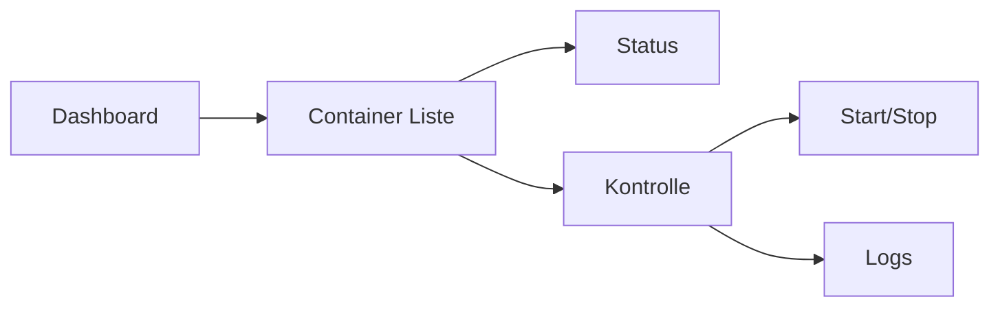
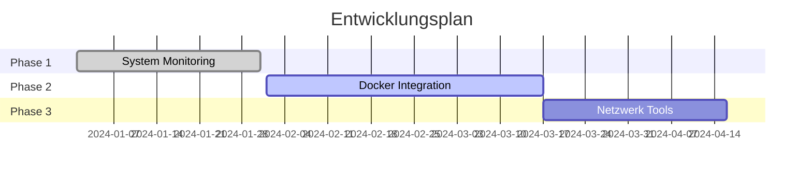

<div align="center">

# 🎯 Mintron Dashboard

[](https://linuxmint.com/)
[](https://www.php.net/)
[](https://httpd.apache.org/)

*Ein modernes, flexibles Dashboard für Systemverwaltung und Monitoring*

---

</div>

## 📂 Verzeichnisstruktur

```plaintext
├── index.php                   # Einstiegspunkt der Anwendung
├── src/                        # Quellcode-Ordner
│   ├── header.php              # Kopfbereich (Header) der Seiten
│   ├── nav.php                 # Navigationselemente
│   ├── scripts/                # JavaScript-Dateien
│   │   ├── dashboard.js        # JavaScript für das Dashboard
│   │   ├── docker.js           # JavaScript für Docker-Module
│   │   ├── global.js           # Globale JavaScript-Funktionen
│   │   ├── log-viewer.js       # JavaScript für Log-Viewer
│   │   └── network.js          # JavaScript für Netzwerkübersicht
│   └── style.css               # CSS für das Design
├── dashboard/                  # Dashboard-Module
│   ├── docker_control.php      # Docker Steuerung
│   ├── docker.php              # Docker-Status und Verwaltung
│   ├── logs.php                # Log-Dateien Übersicht
│   ├── log_viewer.php          # Log-Dateien Viewer
│   ├── network.php             # Netzwerkübersicht
│   ├── repo.php                # Aktuelle Repository-Listen
│   ├── system_info.php         # Systeminformationen
│   ├── upconfig.php            # Konfigurationsdateien und Fehlerprotokolle
│   └── updates.php             # Git-Updates Übersicht
```

---

## 🌟 Highlights

<div align="center">

| 🔍 **Live Monitoring** | 🐳 **Docker Integration** | 🌐 **Netzwerk Management** | 💾 **System Info** |
|-----------------------|--------------------------|---------------------------|--------------------|
| Echtzeit Updates       | Container Verwaltung      | Interface Kontrolle        | Hardware Stats     |

</div>

## 🚀 Installation

Für eine frische Installation eines Systems und die Einrichtung des Mintron Dashboards, folge diesen Schritten:

```bash
# 1. Repository klonen
git clone https://github.com/GSign061/mintron-dashboard.git

# 2. Abhängigkeiten installieren
sudo apt update
sudo apt install -y apache2 php8.4 lm-sensors

# 3. Apache konfigurieren
sudo cp config/mintron.conf /etc/apache2/sites-available/
sudo a2ensite mintron.conf
```

<details>
<summary>📋 Detaillierte Installationsschritte</summary>

```bash
### 1️⃣ **Systempakete installieren**
Führe die folgenden Befehle aus, um benötigte Pakete und Tools zu installieren:

sudo apt update
sudo apt install -y apache2 php8.4 lm-sensors lscpu dmidecode

### 2️⃣ **Sensoren einrichten**
Ermögliche die Erfassung von Temperatur- und Hardwaredaten:

sudo sensors-detect

### 3️⃣ **Apache2 konfigurieren**
Um die Anwendung über Apache2 verfügbar zu machen:

sudo nano /etc/apache2/sites-available/mintron.conf

Füge die folgende Konfiguration hinzu:

<VirtualHost *:80>
    ServerName localhost
    DocumentRoot /path/to/mintron

    <Directory /path/to/mintron>
        AllowOverride All
        Require all granted
    </Directory>

    ErrorLog ${APACHE_LOG_DIR}/mintron_error.log
    CustomLog ${APACHE_LOG_DIR}/mintron_access.log combined
</VirtualHost>

Aktiviere die Konfiguration und starte Apache neu:

sudo a2ensite mintron.conf
sudo systemctl reload apache2

### ⚙️ **Rechte konfigurieren**

Stelle sicher, dass die Verzeichnisrechte korrekt gesetzt sind:

sudo chown -R www-data:www-data /path/to/mintron
sudo chmod -R 755 /path/to/mintron
```

</details>

---

## 🎯 Features

### 🖥️ System Monitoring
- **CPU**: Auslastung, Temperatur, Details
- **RAM**: Speichernutzung, Statistiken
- **Festplatten**: Storage-Übersicht
- **Prozesse**: Live Process Management

### 🐳 Docker Management


### 🌐 Netzwerk Tools
- Interface Monitoring
- Verbindungsstatistiken
- Netzwerkkonfiguration

### 📝 Log-Dateien
- Übersicht aller `.log` Dateien
- Anzeige der letzten 50 Einträge einer ausgewählten Log-Datei

---

## 🔜 Roadmap



---

## 📚 Dokumentation

Für detailliertere Informationen über die einzelnen Funktionen und Konfigurationen:

- **System Monitoring**: Detaillierte Systeminformationen, wie CPU-, RAM- und Festplattendaten.
- **Docker Management**: Steuerung und Überwachung von Docker-Containern.
- **Log-Dateien**: Übersicht und Anzeige von Log-Dateien für Fehlerbehebung und Monitoring.
- **Netzwerk Tools**: Informationen über Netzwerkverbindungen und Schnittstellen.

---

## 🤝 Mitmachen

Hilf mit, das Mintron Dashboard noch besser zu machen! Sieh dir die [öffentlichen Issues](https://github.com/GSign061/mintron-dashboard/issues) an und trage deinen Teil dazu bei.

---

## 📅 Versionen

- **0.1.12** – Erste alpha Version
- **0.1.1** – Erste alpha Version
- **0.1.0** – Erste alpha Version

---

## 🧰 Lizenz

Mintron Dashboard ist unter der MIT-Lizenz lizenziert. Weitere Details findest du in der [LICENSE](LICENSE) Datei.

---

Hier ist deine **To-Do-Liste** für die geplanten Funktionen und zukünftigen Integrationen, übersichtlich in einer Tabelle. Ich habe die bereits implementierten Funktionen mit einem Häkchen markiert.

---

## 📝 To-Do Liste für das System

### **Zusammenfassung der Funktionen**
- **Bereits implementierte Funktionen** bieten umfangreiche Systemüberwachung, Performance-Optimierungen und einfache Verwaltung von Docker-Containern und Netzwerkschnittstellen.
- **Geplante Funktionen** erweitern das System um fortgeschrittene Sicherheitsmaßnahmen wie 2FA, API-Integrationen, automatische Updates und Tools zur Virtualisierung.

| Nr. | Funktion & Integration                           | Status         | Bemerkungen                                      |
|-----|--------------------------------------------------|----------------|--------------------------------------------------|
| 6   | 📊 **Erweiterte Dashboard-Visualisierungen**      | ✅ Implementiert| Erweiterte Visualisierungen der Systemdaten im Dashboard. |
| 5   | 📈 **Performance Optimierungen**                 | ✅ Implementiert| Optimierung der Systemleistung zur Verbesserung der Reaktionsgeschwindigkeit und Effizienz. |
| 4   | ⚠️ **Alarme & Benachrichtigungen**               | ✅ Implementiert| Alarmsystem, das Benachrichtigungen bei kritischen Systemereignissen versendet. |
| 3   | **Log-Dateien aus /var/logs**                    | ✅ Implementiert| Anzeige und Verwaltung von Log-Dateien aus dem Verzeichnis /var/logs. |
| 2   | **Docker Übersicht / Status / Start/Stop/Restart**| ✅ Implementiert| Integration zur Anzeige und Steuerung von Docker-Containern (Start, Stopp, Neustart). |
| 1   | **Netzwerkschnittstellen Übersicht**             | ✅ Implementiert| Anzeige und Übersicht aller Netzwerkschnittstellen auf dem Server. |
| 7   | **Repositorys Übersicht**                        | ✅ Implementiert| Übersicht der System- und Software-Repositories mit Informationen zu den verwendeten Quellen. |
| 8   | **Update Übersicht**                             | ✅ Implementiert| Übersicht der letzten Updates und Git-Commits mit Details zu Autoren, Datum und Änderungen. |
| 9   | **Letzte Änderungen an Dateien**                 | ✅ Implementiert| Anzeige der letzten Änderungen an Systemdateien mit Commit-Informationen und Fehlermeldungen, wenn kein Git-Repository gefunden wird. |

---

### **Geplante Funktionen und Integrationen**

| Nr. | Funktion & Integration                           | Status         | Bemerkungen                                      |
|-----|--------------------------------------------------|----------------|--------------------------------------------------|
| 1   | 📡 **Erweiterte Netzwerküberwachung**             | ❌ Geplant      | Umfassende Überwachung und Analyse des Netzwerkverkehrs zur Identifikation von Engpässen oder Sicherheitslücken. |
| 2   | 🔒 **Zwei-Faktor-Authentifizierung (2FA)**        | ❌ Geplant      | Integration von 2FA zur Verbesserung der Sicherheit beim Zugriff auf das System. |
| 3   | 📚 **API für externe Anwendungen**              | ❌ Geplant      | Bereitstellung einer API, die externen Anwendungen den Zugriff auf bestimmte Systemdaten ermöglicht. |
| 4   | ⚙️ **Automatische System-Updates**               | ❌ Geplant      | Implementierung eines Mechanismus für automatische System- und Software-Updates. |
| 5   | 🔗 **Integrierte Tools für Fehlerbehebung**      | ❌ Geplant      | Bereitstellung von automatisierten Tools zur Fehlerdiagnose und -behebung im System. |
| 6   | 🔌 **Erweiterung für Virtualisierung**           | ❌ Geplant      | Integration von Virtualisierungsplattformen, um das System um virtuelle Maschinen und Container zu erweitern. |
| 7   | **nginx / apache.ini und conf Übersicht und Bearbeitungsfunktion** | ❌ Geplant | Eine Übersicht und Bearbeitungsfunktion für nginx- und apache-Konfigurationsdateien wird entwickelt. |

---

