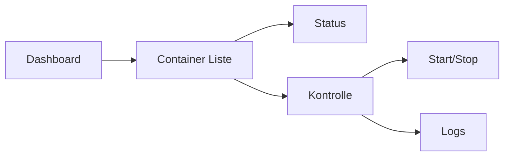

<div align="center">
  
# 🎯 Mintron Dashboard

[](https://linuxmint.com/)
[](https://www.php.net/)
[](https://httpd.apache.org/)

*Ein modernes, flexibles Dashboard für Systemverwaltung und Monitoring*

[🚀 Installation](#installation) • [⚙️ Konfiguration](#konfiguration) • [📚 Dokumentation](#dokumentation) • [🔧 Features](#features)

---
</div>
 
## 📂 **Verzeichnisstruktur**

```plaintext
├── index.php                   # Einstiegspunkt der Anwendung
├── src/                        # Quellcode-Ordner
│   ├── nav.php                 # Navigationselemente
│   ├── header.php              # Kopfbereich (Header) der Seiten
│   ├── script.js               # JavaScript für dynamische Funktionen
│   └── style.css               # CSS für das Design
├── dashboard/                  # Dashboard-Module
│   ├── docker_control.php      # Docker Steuerung
│   ├── docker.php              # Docker-Status und Verwaltung
│   ├── logs.php                # Log-Dateien Übersicht
│   ├── log_viewer.php          # Log-Dateien Viewer
│   ├── network.php             # Netzwerkübersicht
│   ├── repo.php                # Aktuelle Repository-Listen
│   ├── system_info.php         # Systeminformationen:
│   ├── upconfig.php            # Konfigurationsdateien und Fehlerprotokolle
│   └── updates.php             # Git-Updates Übersicht
```
<details>
<summary>Erklärung der Module:</summary>

- **`index.php`**: Der Einstiegspunkt für die Anwendung, wird beim Aufruf der Seite geladen.
- **`src/`**: Enthält alle grundlegenden Skripte und Styles:
  - **`nav.php`**: Die Navigationsleiste der Anwendung.
  - **`header.php`**: Kopfbereich (Header) der Seiten.
  - **`script.js`**: JavaScript für dynamische Funktionen im Dashboard.
  - **`index.php`**: Der Einstiegspunkt für die Anwendung, wird beim Aufruf der Seite geladen.
- **`src/`**: Enthält alle grundlegenden Skripte und Styles:
  - **`nav.php`**: Die Navigationsleiste der Anwendung.
  - **`header.php`**: Kopfbereich (Header) der Seiten.
  - **`script.js`**: JavaScript für dynamische Funktionen im Dashboard.
  - **`style.css`**: Stylesheets für das Design und Layout des Dashboards.
  
- **`dashboard/`**: Die verschiedenen Module für das Dashboard:
  - **`docker_control.php`**: Steuerung der Docker-Container (Starten, Stoppen, Löschen, Erstellen).
  - **`docker.php`**: Verwaltung und Übersicht über Docker-Container.
  - **`logs.php`**: Übersicht über alle Log-Dateien.
  - **`log_viewer.php`**: Anzeige der letzten 50 Einträge einer ausgewählten Log-Datei.
  - **`network.php`**: Zeigt die Netzwerkübersicht und Schnittstellen an.
  - **`repo.php`**: Anzeige der aktuellen Repositories und deren Status.
  - **`system_info.php`**: Verschiedene Systeminformationen:
    - **`Systemzeit`**: Anzeige der aktuellen Systemzeit.
    - **`CPU`**: Zeigt Auslastung, Temperatur, Treiber und Modellinformationen der CPU.
    - **`Arbeitsspeicher`**: Informationen zu RAM (Auslastung, Speichergröße, Treiber, Modell).
    - **`Festplatte`**: Informationen zu HDD/SSD (Speicher, Auslastung, Treiber, Modell).
    - **`Betriebssystem`**: Details zum Betriebssystem (Treiber, Modell).
    - **`Prozesse`**: Übersicht über alle laufenden Prozesse.
  - **`upconfig.php`**: Abrufen und Anzeigen von Apache- und PHP-Fehlerprotokollen sowie Apache-Konfigurationsdateien.
  - **`updates.php`**: Anzeige der letzten Git-Commits und Dateiänderungen.

</details>

<div align="center">

---


</div>

---

## 🌟 Highlights

<div align="center">

| 🔍 Live Monitoring | 🐳 Docker Integration | 🌐 Netzwerk Management | 💾 System Info |
|-------------------|----------------------|----------------------|----------------|
| Echtzeit Updates | Container Verwaltung | Interface Kontrolle | Hardware Stats |

</div>

## 🚀 Installation

```bash
# 1. Repository klonen
git clone https://github.com/GSign061/mintron-dashboard.git

# 2. Abhängigkeiten installieren
sudo apt update
sudo apt install -y apache2 php8.2 lm-sensors

# 3. Apache konfigurieren
sudo cp config/mintron.conf /etc/apache2/sites-available/
sudo a2ensite mintron.conf
```

<details>
<summary>📋 Detaillierte Installationsschritte</summary>

```bash
### 1️⃣ **Systempakete installieren**
Führen Sie die folgenden Befehle aus, um benötigte Pakete und Tools zu installieren:

bash
sudo apt update
sudo apt install -y lm-sensors lscpu dmidecode apache2 php8.2

### 2️⃣ **Sensoren einrichten**
Ermöglichen Sie die Erfassung von Temperatur- und Hardwaredaten:

bash
sudo sensors-detect

### 3️⃣ **Apache2 konfigurieren**
Um die Anwendung über Apache2 verfügbar zu machen:

bash
sudo nano /etc/apache2/sites-available/mintron.conf

Fügen Sie die folgende Konfiguration hinzu:

plaintext
<VirtualHost *:80>
    ServerName localhost
    DocumentRoot /path/to/mintron

    <Directory /path/to/mintron>
        AllowOverride All
        Require all granted
    </Directory>

    ErrorLog ${APACHE_LOG_DIR}/mintron_error.log
    CustomLog ${APACHE_LOG_DIR}/mintron_access.log combined
</VirtualHost>

**Konfiguration aktivieren und Apache neustarten:**

bash
sudo a2ensite mintron.conf
sudo systemctl reload apache2

---

## ⚙️ **Rechte konfigurieren**

Stellen Sie sicher, dass die Verzeichnisrechte korrekt gesetzt sind:

bash
sudo chown -R www-data:www-data /path/to/mintron
sudo chmod -R 755 /path/to/mintron

---
```

</details>

## 🎯 Features

### 🖥️ System Monitoring
- **CPU**: Auslastung, Temperatur, Details
- **RAM**: Speichernutzung, Statistiken
- **Festplatten**: Storage-Übersicht
- **Prozesse**: Live Process Management

### 🐳 Docker Management


### 🌐 Netzwerk Tools
- Interface Monitoring
- Verbindungsstatistiken
- Netzwerkkonfiguration

### 📝 Log-Dateien
- Übersicht aller `.log` Dateien
- Anzeige der letzten 50 Einträge einer ausgewählten Log-Datei

## 📊 Dashboard Module

| Modul | Beschreibung | Status |
|-------|-------------|---------|
| System Info | Hardware & OS Details | ✅ |
| Docker | Container Management | ✅ |
| Network | Interface Control | ✅ |
| Repos | Repository Management | 🚧 |
| Logs | Log-Dateien Übersicht | ✅ |

## 🔜 Roadmap


## 📖 **Hilfen**

<details>
<summary>❓ Apache2 installieren und konfigurieren</summary>

1. Installiere Apache2:
   

bash
   sudo apt install apache2

2. Erstelle eine neue Konfigurationsdatei:
   

bash
   sudo nano /etc/apache2/sites-available/mintron.conf


   (Inhalt siehe oben)

3. Aktiviere die Konfiguration und starte Apache neu:
   

bash
   sudo a2ensite mintron.conf
   sudo systemctl reload apache2

4. Überprüfen, ob Apache läuft:
   

bash
   systemctl status apache2

</details>

<details>
<summary>❓ PHP installieren</summary>

1. Füge das PHP-Repository hinzu (falls nicht vorhanden):
   

bash
   sudo apt install software-properties-common
   sudo add-apt-repository ppa:ondrej/php

2. Installiere PHP 8.2:
   

bash
   sudo apt update
   sudo apt install php8.2 libapache2-mod-php8.2

3. Überprüfen Sie die PHP-Version:
   

bash
   php -v

4. Apache2 mit PHP-Unterstützung neustarten:
   

bash
   sudo systemctl restart apache2

</details>

<details>
<summary>❓ Zusätzliche Pakete für ein neues System</summary>

Für ein komplett neues System sollten folgende Pakete zusätzlich installiert werden:

bash
sudo apt install -y curl git unzip zip

Docker-Installation (falls benötigt):

bash
sudo apt install -y docker.io
sudo systemctl enable --now docker

Nützliche Werkzeuge:

bash
sudo apt install htop ncdu net-tools

</details>

<details>
<summary>❓ Rechte-Management</summary>

Stellen Sie sicher, dass Apache die richtigen Rechte hat:

bash
sudo chown -R www-data:www-data /path/to/mintron
sudo chmod -R 755 /path/to/mintron

Wenn PHP-Dateien nicht ausführbar sind, prüfen Sie die Apache-Einstellungen:

bash
sudo a2enmod php8.2
sudo systemctl restart apache2

</details>

---

## 🔗 **Dashboard starten**

Öffnen Sie das Dashboard nach der Installation im Webbrowser:

plaintext
http://localhost/index.php

## 💡 Beitragen

```
🌟 Fork -> 🔧 Feature -> 🚀 Pull Request
```

## 📄 Lizenz

MIT © [GSign061]

---

<div align="center">

### 🌟 Folg uns auf GitHub!

---

### To-Do-Liste für geplante Funktionen und zukünftige Integrationen

Hier ist eine strukturierte Übersicht der geplanten und zukünftigen Funktionen für das Mintron-Dashboard:

#### **1. Docker-Dashboard**
**Funktionen:**
- ✅ Container bearbeiten, starten, stoppen, löschen
- ✅ Neue Container hinzufügen
- ✅ Details anzeigen (z. B. Status, Name, ID)
- ✅ Log-Ansicht der Container
- Integration von Docker-Statistiken (Ressourcenverbrauch)

---

#### **2. Repository-Management (repo.php)**
**Funktionen:**
- ✅ Repositories anzeigen, bearbeiten und löschen
- Neues Repository hinzufügen
- Prüfung der Repository-Verfügbarkeit
- Automatische Aktualisierungsliste (apt update)
- Validierung von sources.list-Einträgen

---

#### **3. Netzwerkschnittstellen**
**Änderungen:**
- Überflüssige Buttons oder redundante Aktionen entfernen
- ✅ Details zu aktiven Schnittstellen anzeigen (z. B. IP-Adresse, MAC-Adresse, Status)
- Möglichkeit, Schnittstellen zu aktivieren oder deaktivieren

---

#### **4. Grafikkarten-Status und Informationen**
**Geplante Funktionen:**
- Anzeige der Grafikkarten-Treiber-Version
- Speichernutzung der GPU
- Temperaturüberwachung
- Unterstützung für NVIDIA/AMD/Intel GPUs (mit Tools wie nvidia-smi oder rocm-smi)

---

#### **5. Cron-Management (cron.php)**
**Funktionen:**
- Cron-Jobs anzeigen, hinzufügen, bearbeiten und löschen
- Details zu jedem Job (z. B. nächster Ausführungszeitpunkt, Kommando)
- Fehlerprüfung für Cron-Ausdrücke
- Log-Ansicht der letzten Cron-Ausführungen

---

#### **Zukünftige Integration (geplant):**

##### **Dateimanager**
- Anzeigen, Hochladen und Bearbeiten von Dateien direkt im Dashboard
- Rechte-Management (Lesen, Schreiben, Ausführen)
- Unterstützung für gängige Dateiformate

##### **Terminal**
- Ein eingebettetes Terminal für direkte Befehlsausführung
- Authentifizierung für sensible Operationen
- Unterstützung für Syntax-Highlighting

---

[⬆️ Nach oben](#mintron-dashboard)

</div>
