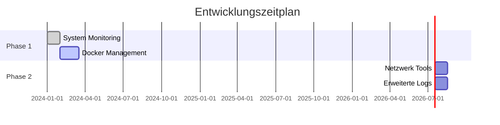

<div align="center">

# 🚀 Mintron Dashboard

[](https://linuxmint.com/)
[](https://www.php.net/)
[](https://httpd.apache.org/)

Ein leistungsstarkes, flexibles Dashboard zur Systemverwaltung und Überwachung.

---

</div>

## 📑 Inhaltsverzeichnis

1. [📖 Überblick](#-überblick)
2. [📂 Verzeichnisstruktur](#-verzeichnisstruktur)
3. [🎯 Features](#-features)
4. [🚀 Installation](#-installation)
5. [📋 Dokumentation](#-dokumentation)
6. [📅 Roadmap](#-roadmap)
7. [🤝 Mitmachen](#-mitmachen)
8. [📚 Lizenz](#-lizenz)


---


### 🎨 Design

Das Mintron Dashboard verwendet ein futuristisches, kontrastreiches Design mit dunklem Thema und Neon-Akzenten. Die Design-Highlights sind:

- **Hintergrund**: Ein statisches Bild mit Weltraum-Thema, das einen modernen und futuristischen Look erzeugt.
- **Farbschema**:
  - **Hintergrundfarbe**: Tiefes Schwarz (`#09090b`) für maximale Lesbarkeit.
  - **Akzentfarbe**: Neon-Grün/Türkis (`#00ffcc`) für interaktive Elemente und Highlights.
  - **Oberflächenfarben**: Mehrstufige Grautöne (`#101012`, `#27272a`, `#52525b`) für unterschiedliche Ebenen der Benutzeroberfläche.
- **Schriftart**: 'Poppins', eine moderne und klare Sans-Serif-Schrift.
- **Effekte**:
  - **Hover-Effekte**: Buttons und Links leuchten beim Überfahren mit der Maus mit einem subtilen Glüheffekt.
  - **Animationen**: Dekorative Planeten und Sterne schweben langsam im Hintergrund, wodurch das Dashboard dynamisch und lebendig wirkt.
  - **Fortschrittsbalken**: Fortschrittsbalken mit weichen Übergängen zur Visualisierung von RAM- und Speicherplatznutzung.
- **Responsive Design**: Optimiert für Desktop- und Mobile-Geräte.

Das visuelle Thema des Dashboards ist perfekt geeignet für technologische und Überwachungsanwendungen.

---

## 📖 Überblick

Mintron Dashboard ist eine moderne, modulare Anwendung, die auf Linux-Servern läuft. Sie bietet umfassende Monitoring- und Verwaltungsfunktionen für Hardware, Docker-Container, Netzwerk, Log-Dateien und mehr.

---

## 📂 Verzeichnisstruktur

```plaintext
.
├── index.php                   # Einstiegspunkt der Anwendung
├── src/                        # Quellcode-Ordner
│   ├── header.php              # Kopfbereich der Seiten
│   ├── nav.php                 # Navigationselemente
│   ├── scripts/                # JavaScript-Dateien
│   │   ├── dashboard.js        # Funktionen für Systemmonitoring
│   │   ├── docker.js           # Docker-Verwaltung
│   │   ├── global.js           # Globale Funktionen
│   │   ├── log-viewer.js       # Log-Dateien Anzeige
│   │   └── network.js          # Netzwerkmonitoring
│   └── style.css               # Anwendungsspezifische Stile
├── dashboard/                  # Backend-Module
│   ├── api/                    # API-Endpunkte
│   │   ├── docker_control.php  # Docker-Controller
│   │   ├── log_viewer.php      # API für Logs
│   │   ├── system_info.php     # Systeminformations-API
│   │   └── upconfig.php        # Konfigurationsdateien und Logs
│   └── view/                   # Frontend-Module
│       ├── docker.php          # Docker-Dashboard
│       ├── logs.php            # Logs-Dashboard
│       ├── network.php         # Netzwerkübersicht
│       ├── repo.php            # Repository-Übersicht
│       └── updates.php         # Git-Updates
├── .old/                       # Archiv älterer Versionen
│   └── ...                     # Veraltete Module und Dateien
├── site.webmanifest            # Manifest-Datei für Webbrowser
├── mintron_summary.txt         # Zusammenfassung des Projekts
└── src/images/                 # Bilder und Icons
```

---

## 🎯 Features

- **Live-Systemüberwachung**: CPU-, RAM- und Festplattendaten in Echtzeit.
- **Docker-Integration**: Start, Stop und Überwachung von Containern.
- **Netzwerktools**: Interface-Monitoring und Konfigurationsübersicht.
- **Log-Dateien**: Anzeige und Verwaltung von System-Logs.
- **Git-Updates**: Anzeige der letzten Commits und Dateiänderungen.
- **Responsive Design**: Optimiert für Desktop und Mobile.

---

## 🚀 Installation

### 1️⃣ Voraussetzungen

- **Betriebssystem**: Linux (z.B. Ubuntu, Linux Mint)
- **Abhängigkeiten**:
  - Apache 2.4+
  - PHP 8.4+
  - lm-sensors, lscpu, dmidecode

### 2️⃣ Einrichtung

```bash
# 1. Repository klonen
git clone https://github.com/GSign061/mintron-dashboard.git
cd mintron-dashboard

# 2. Abhängigkeiten installieren
sudo apt update
sudo apt install -y apache2 php8.4 lm-sensors

# 3. Apache konfigurieren
sudo cp config/mintron.conf /etc/apache2/sites-available/
sudo a2ensite mintron.conf
sudo systemctl reload apache2
```

<details>
<summary>📋 Detaillierte Installationsanleitung</summary>

```bash
# Zusätzliche Abhängigkeiten installieren
sudo sensors-detect

# Rechte setzen
sudo chown -R www-data:www-data /path/to/mintron
sudo chmod -R 755 /path/to/mintron

# Logs prüfen
sudo tail -f /var/log/apache2/mintron_error.log
```

</details>

---

## 📋 Dokumentation

### 1️⃣ System Monitoring

- **CPU**: Zeigt Auslastung, Temperatur und Details.
- **RAM**: Verfolgt Speicherverbrauch und -statistiken.
- **Speicherplatz**: Detaillierte Partition-Übersicht.

### 2️⃣ Docker Management

- Übersicht aktiver Container.
- Start, Stop und Löschen von Containern.
- Fehlerprotokolle in Echtzeit.

### 3️⃣ Netzwerktools

- Anzeige aller Netzwerkschnittstellen und IP-Adressen.
- Überwachung der Netzwerknutzung.

### 4️⃣ Log-Dateien

- Übersicht über alle `.log` Dateien.
- Anzeige der letzten 50 Zeilen für eine schnelle Fehlerdiagnose.

---

## 📅 Roadmap



---

## 🤝 Mitmachen

- Diskutiere Features in [Issues](https://github.com/GSign061/mintron-dashboard/issues).
- Forke das Projekt und schicke einen Pull Request!

---

## 📚 Lizenz

Dieses Projekt steht unter der **MIT-Lizenz**. Details findest du in der [LICENSE](LICENSE)-Datei.

---

<div align="center">
💡 Entwickelt mit Liebe und Leidenschaft für Open-Source!
</div>
