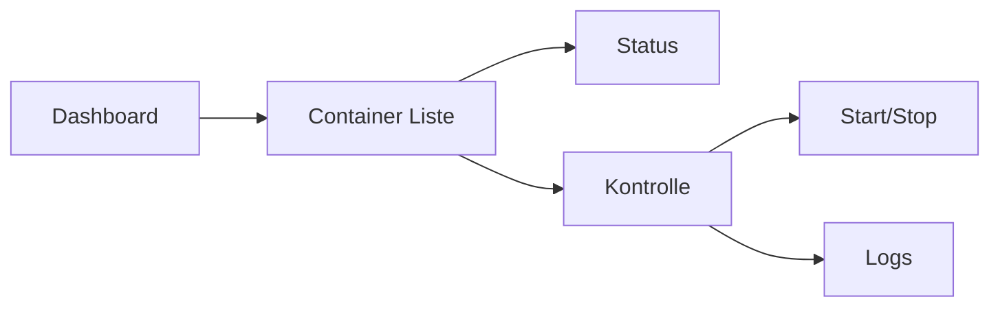

<div align="center">
  
# 🎯 Mintron Dashboard

[](https://linuxmint.com/)
[](https://www.php.net/)
[](https://httpd.apache.org/)

*Ein modernes, flexibles Dashboard für Systemverwaltung und Monitoring*

[🚀 Installation](#installation) • [⚙️ Konfiguration](#konfiguration) • [📚 Dokumentation](#dokumentation) • [🔧 Features](#features)


</div>

---

## 🌟 Highlights

<div align="center">

| 🔍 Live Monitoring | 🐳 Docker Integration | 🌐 Netzwerk Management | 💾 System Info |
|-------------------|----------------------|----------------------|----------------|
| Echtzeit Updates | Container Verwaltung | Interface Kontrolle | Hardware Stats |

</div>

## 🚀 Installation

```bash
# 1. Repository klonen
git clone https://github.com/GSign061/mintron-dashboard.git

# 2. Abhängigkeiten installieren
sudo apt update
sudo apt install -y apache2 php8.2 lm-sensors

# 3. Apache konfigurieren
sudo cp config/mintron.conf /etc/apache2/sites-available/
sudo a2ensite mintron.conf
```

<details>
<summary>📋 Detaillierte Installationsschritte</summary>

```bash
# Weitere Installationsschritte...
```

</details>

## 🎯 Features

### 🖥️ System Monitoring
- **CPU**: Auslastung, Temperatur, Details
- **RAM**: Speichernutzung, Statistiken
- **Festplatten**: Storage-Übersicht
- **Prozesse**: Live Process Management

### 🐳 Docker Management


### 🌐 Netzwerk Tools
- Interface Monitoring
- Verbindungsstatistiken
- Netzwerkkonfiguration

## 📊 Dashboard Module

| Modul | Beschreibung | Status |
|-------|-------------|---------|
| System Info | Hardware & OS Details | ✅ |
| Docker | Container Management | ✅ |
| Network | Interface Control | ✅ |
| Repos | Repository Management | 🚧 |

## 🔜 Roadmap


## 💡 Beitragen

```
🌟 Fork -> 🔧 Feature -> 🚀 Pull Request
```

## 📄 Lizenz

MIT © [GSign061]

---

<div align="center">

### 🌟 Folg uns auf GitHub!

[⬆️ Nach oben](#mintron-dashboard)

</div>
